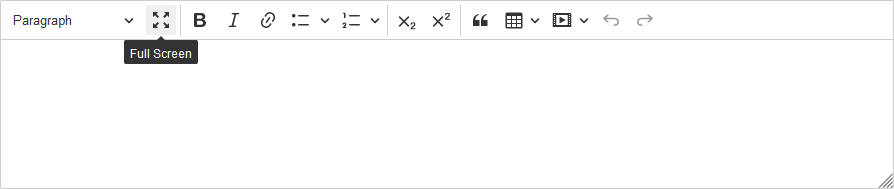

# CKEditor 5 FullScreen Plugin

Maximize your CKEditor 5 editing space with the FullScreen plugin. Offering a seamless way to expand the editor to full screen, it ensures an uninterrupted and expansive writing canvas.
This plugin is compatible with various browsers including Chrome, Firefox, Safari, Edge, and Internet Explorer, among others. It provides support for both the latest and older versions of these browsers. It's also optimized for devices like iPhones, iPads, Android devices, and desktop computers.



## Support the Author

If you find this plugin useful, consider supporting the author to create and maintain more open-source projects. Every contribution, however big or small, is very valuable.

[](https://www.paypal.com/donate/?hosted_button_id=WR6B6DNBN2KQS)

## Prerequisites

Before you begin, ensure you have the following dependencies installed:

- [CKEditor 5 Core](https://www.npmjs.com/package/@ckeditor/ckeditor5-core)
- [CKEditor 5 UI](https://www.npmjs.com/package/@ckeditor/ckeditor5-ui)

Install them using npm:

```bash
npm install --save @ckeditor/ckeditor5-core @ckeditor/ckeditor5-ui
```

## Features

- Toggle the CKEditor instance to fullscreen mode for an immersive editing experience.
- Seamless integration with CKEditor 5.
- Customizable toolbar icon for easy access.

## Installation

1. **Using npm**:

   ```bash
   npm install @pikulinpw/ckeditor5-fullscreen
   ```

2. **Manual Installation**:

    - Clone or download this repository.
    - Add it to your CKEditor 5 build using the standard Webpack module imports.

## Usage

1. Add `'fullScreen'` to your editor's plugin list:

```javascript
import FullScreen from '@pikulinpw/ckeditor5-fullscreen';

ClassicEditor
    .create(document.querySelector('#editor'), {
        plugins: [ ..., FullScreen, ...],
        toolbar: [ ..., 'fullScreen', ...]
    })
    .then(editor => {
        console.log(editor);
    })
    .catch(error => {
        console.error(error.stack);
    });
```

2. Add `'fullScreen'` to your toolbar configuration to see the fullscreen button.

## Customization

You can customize the appearance and behavior of the FullScreen plugin by tweaking the source code. All the necessary files (including styles and icons) are available in the source code.

## License

This project is licensed under the MIT License. See the [LICENSE](LICENSE.md) file for details.

## Feedback and Contributions

Feedback, bug reports, and pull requests are welcome. Feel free to [open an issue](https://github.com/pikulinpw/ckeditor5-fullscreen/issues) or submit a pull request if you have something to contribute.
